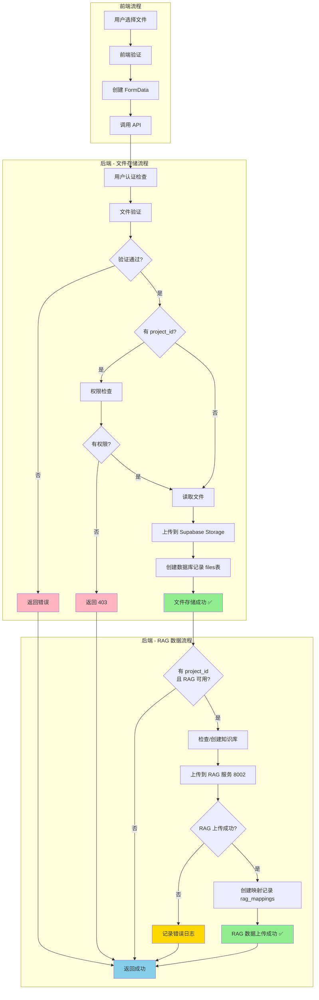

# 文件上传流程 - 简化版

## 双流程架构

文件上传分为两个独立的流程：

### 流程1: 文件存储（必执行）
```
用户选择文件
    ↓
前端验证（大小、类型）
    ↓
POST /api/v1/files/upload
    ↓
后端验证（权限、文件）
    ↓
上传到 Supabase Storage
    ↓
创建数据库记录（files表）
    ↓
返回文件信息 ✅
```

### 流程2: RAG 数据（条件执行）
```
[仅在指定 project_id 时执行]
    ↓
检查/创建项目知识库（project_{project_id}）
    ↓
上传到 RAG 服务（8002端口）
    ↓
RAG 处理（解析、分块、向量化）
    ↓
创建映射记录（rag_mappings表）
    ↓
完成 ✅
```

## 完整流程图



## 关键点

1. **文件存储是主要流程**，必须成功
2. **RAG 数据是附加流程**，失败不影响文件存储
3. **两个流程并行执行**，互不阻塞
4. **RAG 服务端口**: 8002
5. **使用 admin_client 绕过 RLS**，确保数据库记录创建成功

